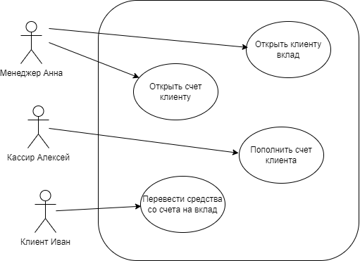

# Микросервис "Банковские счета"

## UseCase

- менеджер банка Анна, открыла клиенту Ивану бесплатный текущий счёт, чтобы он мог хранить средства.
- менеджер банка Анна, открыла клиенту Ивану срочный вклад «Надёжный‑6» под 3% годовых, чтобы он смог накопить средства.
- кассир банка Алексей, пополнил текущий счёт клиента Ивана на 1000 рублей наличными.
- клиент банка Иван, перевёл 200 рублей со своего текущего счёта на вклад «Надёжный‑6», чтобы пополнить вклад.




# Запуск

```
docker-compose up --build
```
**Замечание**: загрузка сервиса аутентификации `Keycloak` может занять некоторое время,
т.к. будет происходить конфигурация.

# Swagger

```
http://localhost/swagger/index.html
```

# Тестовые данные

POST /auth/login - Аутентификация

```json
{
  "username": "user1",
  "password": "123"
}
```
