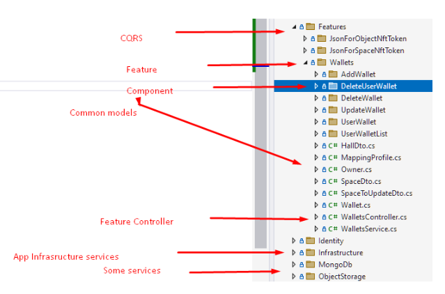

# Цель задания:

- Сформировать навык создания простого сервиса.
- Проектирование REST API, работа с библиотеками `Mediatr` и `Fluent validation`

# Описание бизнес задачи:

На протяжении курса мы будем разрабатывать микросервис «Банковские счета», обслуживающий процессы розничного банка.
На данном этапе реализации сервиса мы хотим реализовать следующие пользовательские истории:

- менеджер банка Анна, открыла клиенту Ивану бесплатный текущий счёт, чтобы он мог хранить средства.
- менеджер банка Анна, открыла клиенту Ивану срочный вклад «Надёжный‑6» под 3% годовых, чтобы он смог накопить средства.
- кассир банка Алексей, пополнил текущий счёт клиента Ивана на 1000 рублей наличными.
- клиент банка Иван, перевёл 200 рублей со своего текущего счёта на вклад «Надёжный‑6», чтобы пополнить вклад.

После груминга было решено создать сервис «Счета» (Account Service) с REST‑API, который позволяет:

- создать счёт
- изменить счёт
- удалить счёт
- получить список счетов
- зарегистрировать транзакцию по счёту
- выполнить перевод между счётами
- выдать выписку клиенту
- проверить наличие счёта у клиента

## Свойства счёта

- id (GUID)
- ownerId (GUID)
- тип (Checking|Deposit|Credit)
- валюта (ISO4217)
- баланс (decimal)
- процентная ставка (decimal, опционально — только для Deposit и Credit)
- дата открытия
- дата закрытия (опционально)
- коллекция транзакций

## Свойства транзакции

- id (GUID)
- accountId (GUID)
- counterpartyAccountId (GUID, опционально)
- сумма (decimal)
- валюта (ISO4217)
- тип (Credit|Debit)
- описание
- дата/время

# Техническая задача:

- Настроить окружение:
  - Установить VS 2022 Community Edition
  - Установить Resharper
- Спроектировать REST API согласно бизнес заданию, только для тех методов и свойств, используя регламент из `Приложения 1`
- Создать сервис WebApi dotnet 9
- Реализовать спроектированный REST API используя заглушки. Формат данных - JSON.
- Подключить библиотеку Mediatr 
  https://github.com/jbogard/MediatR  
  https://code-maze.com/cqrs-mediatr-fluentvalidation/
- Заменить логику в контроллерах на вызов соответствующих операций Mediatr
- Подключить библиотеку FluentValidation https://github.com/FluentValidation/FluentValidation
- Включить библиотеку FluentValidation в pipeline Mediatr https://www.youtube.com/watch?v=2JzQuIvxIqk
- Создать и подключить фильтр для обработки ошибок валидации которые вызваны работой FuentValidation
- Реализовать валидацию запросов
- Подключить swagger для документации API https://github.com/domaindrivendev/Swashbuckle.AspNetCore
- Все методы API и их параметры должны быть описаны, также указаны возвращаемые значения
- Создать заглушку сервиса хранения счетов (CRUD модель).
- Создать заглушку сервиса верификации клиентов (метод проверки существования ownerId).
- Создать заглушку сервиса валют (метод проверки поддерживаемой валюты).
- С помощью этих заглушек реализовать функционал сервиса.
- Опубликовать сервис на github и прислать ссылку куратору. @cyber_universe 

* В данном контексте заглушка - класс с простейшей реализацией требуемых операций
(например, in‑memory лист, внедряемый как Singleton).

# Критерии приемки:

- Сервис опубликован на github как public
- Сервис запускается будучи открыт в VS2022
- При запуске открывается страница swagger
- Все методы, параметры REST API и возвращаемые значения документированы на странице swagger
- Можно провести все CRUD операции с событиями используя JSON для обмена данными.
- REST API должен удовлетворять Регламенту из Приложения 1
- Все зависимости должны передаваться через интерфейсы
- При задании некорректных дат события (начало позже окончания, например), или не существующих изображения или пространства, или если пространство null - выдается 400 ошибка с указанием причины.
- Функционал реализован с использованием Mediatr и FlientValidation
- Код должен быть оформлен в соответствии с правилами оформления Resharper по умолчанию.
- Должно быть 0 замечаний при анализе Resharper code issues in solution

# Приложение 1:

## Регламент REST API

Требования к REST API микросервисов

Формат передачи данных:
 
- Данные передаются в формате JSON.
- Исключение составляет передача файлов, для которой используются соответствующие форматы (например, multipart/form-data).

Использование HTTP-методов:

- Для получения данных используется метод GET.
- Для идемпотентного изменения (замена целиком) ресурса используется метод PUT.
- Для частичного изменения ресурса используется метод PATCH.
- Для неидемпотентных операций и создания новых ресурсов используется метод POST.
- Для удаления ресурсов используется метод DELETE.

Исключение: если параметры GET-запроса превышают допустимый размер, допускается реализация запроса на получение данных через метод POST.

Документирование REST API:

- Каждый метод REST API должен быть документирован в Swagger (OpenAPI).
- Документация метода должна содержать модель входящих данных, если метод принимает данные.
- Документация метода должна содержать модель исходящих данных, если метод возвращает данные.
- Документация метода должна содержать текстовое описание, если действие метода не очевидно из его названия и/или HTTP-метода.

Формирование URL
На примере сущности house используются следующие правила:

- Получение всех сущностей: GET /houses
- Получение сущностей с фильтрацией и сортировкой: GET /houses?type=barnhouse&orderBy=name
- Получение конкретной сущности по идентификатору: GET /houses/{houseId}
- Добавление новой сущности: POST /houses
- Изменение сущности целиком: PUT /houses/{houseId}
- Удаление сущности: DELETE /houses/{houseId}
- Получение отдельного свойства сущности (например, type): GET /houses/{houseId}/type
- Изменение отдельного свойства сущности: PUT /houses/{houseId}/type
- Получение вложенных коллекций и свойств (например, комнат дома): GET /houses/{houseId}/rooms
- При большой иерархии вложенных ресурсов и необходимости упрощения запросов допустимо переносить вложенные коллекции на верхний уровень. Например: GET /rooms?houseId=1

Сериализация перечислимых типов:
- Перечислимые свойства сериализуются в виде строковых значений

# Приложение 2

Рекомендуемая структура папок проекта 

# Приложение 3

- Код должен быть оформлен в соответствии с правилами оформления Resharper по умолчанию. 
- Должно быть 0 замечаний при анализе Resharper code issues in solution
